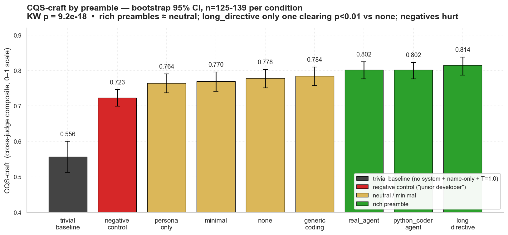
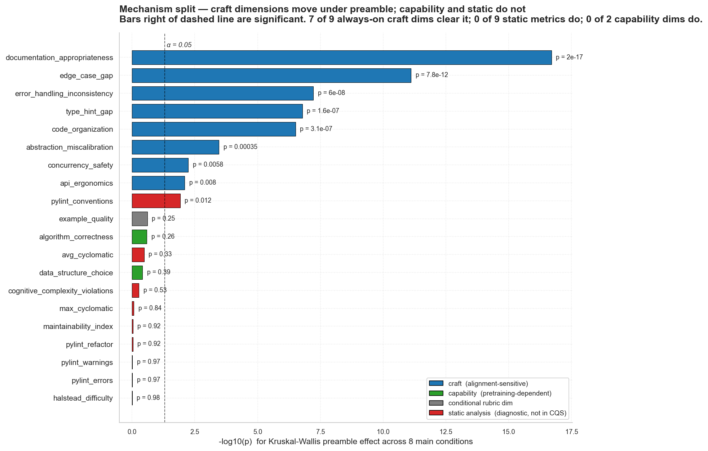
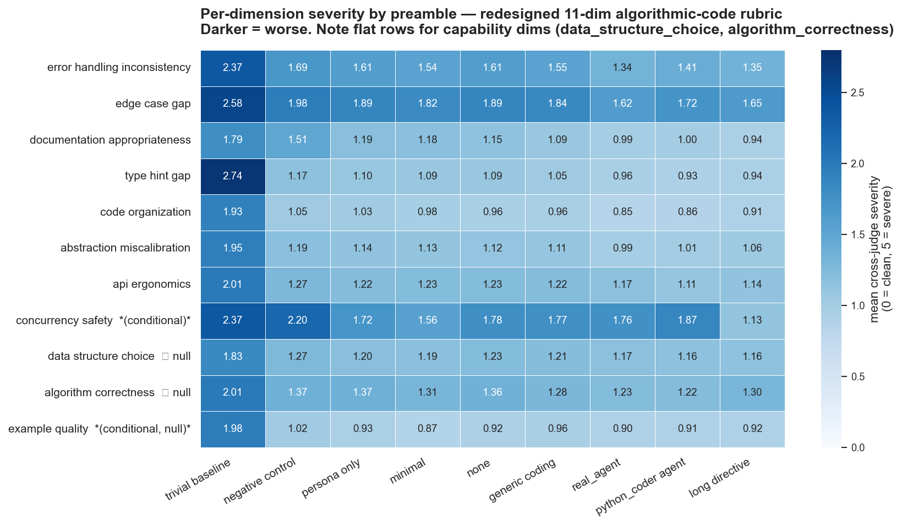
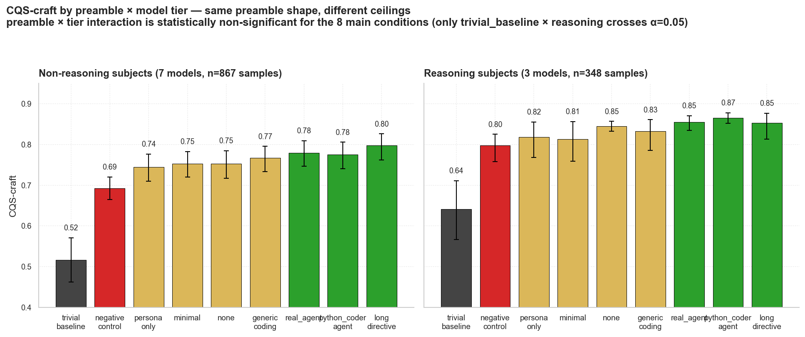

# LLM Preamble Quality Experiments

Do coding-agent preambles (system prompts) change the quality of code an LLM writes?

**Yes — and the v2 design pins down the mechanism precisely. Bad preambles measurably hurt; the strongest rich preamble (`long_directive`) measurably helps; most other preambles do not differ from no preamble at all. The effect lives on alignment-dependent craft axes (error handling, edge cases, type discipline, organization, documentation) and not on pretraining-dependent capability axes (algorithm correctness, data-structure choice).**

This repo contains two pre-registered investigations of the question. v2 supersedes v1; v1 is preserved as the instrument-correction motivation for v2.

| Investigation | Date | Status | Headline |
|---|---|---|---|
| [`preamble_quality_experiment/`](preamble_quality_experiment/) (v1) | 2026-05 | Complete | Hypothesis supported on LLM-judge components (idiom p = 0.002, comment p = 0.006), but the pre-registered composite was null (p = 0.63) because 65%-weighted static analysis is preamble-insensitive. Diagnosed as a metric artifact. |
| [`preamble_quality_experiment_v2/`](preamble_quality_experiment_v2/) (v2) | 2026-05 | **Complete — active design** | **Hypothesis SUPPORTED at p = 9.2 × 10⁻¹⁸**, with a corrected instrument (LLM-judge-only CQS, redesigned 11-dim algorithmic-code rubric, calibrated multi-judge panel, reasoning-inclusive 10-model pool). 7 of 9 craft dimensions move with preamble; 2 capability dimensions do not — mechanism confirmed. |

The full results, debate scorecard, and limitations are in v2's [`CONCLUSIONS.md`](preamble_quality_experiment_v2/CONCLUSIONS.md). The methodology journey that produced the v2 design is in [`REPORT_ADDENDUM.md`](preamble_quality_experiment_v2/REPORT_ADDENDUM.md). The raw per-condition statistics are in [`experiment_v2_results/REPORT.md`](preamble_quality_experiment_v2/experiment_v2_results/REPORT.md).

---

## Headline conclusions (v2)

### 1. Preambles affect code quality. Robustly.

Kruskal–Wallis across 8 main preamble conditions, pooled across the 10-model pool: **p = 9.2 × 10⁻¹⁸**. The effect survives every weighting scheme tested (7 alternative CQS weight combinations, all p ≤ 2.4 × 10⁻¹⁰ — see [WEIGHT_SENSITIVITY.md](preamble_quality_experiment_v2/experiment_v2_results/WEIGHT_SENSITIVITY.md)) and shows up across both reasoning and non-reasoning model tiers (KW p < 2.3 × 10⁻¹² in each tier separately).



### 2. The effect is asymmetric: bad preambles hurt strongly, good preambles help modestly.

Mixed-effects model `CQS ~ preamble * tier + (1|model) + (1|task)`, fixed effects vs `none` reference cell:

| Preamble | β (CQS units) | p | Verdict |
|---|---|---|---|
| `trivial_baseline` (no system + name-only prompt + T=1.0) | −0.255 | 3 × 10⁻⁶¹ | Decisive degradation |
| `negative_control` ("junior developer") | −0.060 | 5 × 10⁻⁵ | Significant degradation |
| `minimal` ("helpful assistant") | 0.000 | 0.99 | No effect |
| `generic_coding` ("expert engineer; write clean code") | +0.014 | 0.33 | No effect |
| `persona_only` ("senior staff engineer") | −0.007 | 0.64 | No effect |
| `real_agent` (6-clause directive list) | +0.027 | 0.067 | Marginal |
| `python_coder_agent` (real production system prompt) | +0.023 | 0.126 | No effect at α = 0.05 |
| `long_directive` (**12-clause** directive list) | **+0.046** | **0.002** | **Significant lift over `none`** |

**`long_directive` is the only preamble that clearly beats no preamble after controlling for model and task variance.** Other "rich" preambles produce small directional lifts (β ≈ +0.02) that don't quite cross α = 0.05.

### 3. The mechanism splits cleanly: preambles move craft, not capability.

Per-dimension severity (0–5 scale) on the redesigned 11-dim algorithmic-code rubric, cross-judge panel mean. The 7 always-on dimensions that move with preamble are all alignment-dependent craft axes; the 2 that don't are pretraining-dependent capability axes:

| Dimension | KW p | Type |
|---|---|---|
| `error_handling_inconsistency` | < 10⁻⁴ | Craft (alignment) |
| `edge_case_gap` | < 10⁻⁴ | Craft |
| `documentation_appropriateness` | < 10⁻⁴ | Craft |
| `code_organization` | < 10⁻⁴ | Craft |
| `type_hint_gap` | < 10⁻⁴ | Craft |
| `abstraction_miscalibration` | 4 × 10⁻⁴ | Craft |
| `api_ergonomics` | 0.008 | Craft |
| `concurrency_safety` | 0.006 | Craft (conditional dim) |
| `algorithm_correctness` | 0.26 | **Capability (pretraining)** |
| `data_structure_choice` | 0.39 | **Capability** |

And independently: **8 of 9 static-analysis metrics are flat across preambles** (maintainability index, cyclomatic complexity, Halstead, pylint errors/warnings/refactor, cognitive complexity — all KW p > 0.5; only `pylint_conventions` shows a weak signal at p = 0.012). v1's instrument-correction is fully validated — static analysis and LLM judges measure substantively different signals.



The figure above shows −log₁₀(p) for the KW preamble effect on every measured dimension. The split is the headline mechanism finding made visible: every craft dimension (blue) is preamble-sensitive; every capability dimension (green) and every static-analysis metric (red) is not.



The heatmap reads left-to-right across the same preamble ordering as the headline chart: `trivial_baseline` is dark blue (high severity = bad) on every dimension, and the gradient lightens monotonically toward `long_directive` on every dimension that is preamble-sensitive. Dimensions that *aren't* preamble-sensitive (`data_structure_choice`, `algorithm_correctness`, `example_quality`) show flat-ish rows.

### 4. The effect is invariant across model tiers.

A formal `preamble × tier` interaction test using all 1,215 samples finds no significant interaction for any of the 8 main conditions (only `trivial_baseline × reasoning` reaches p < 0.05 — reasoning models tolerate the degenerate input slightly better). Reasoning models score ~0.087 CQS-units higher in absolute terms (p = 0.12, underpowered with 3-vs-7 model imbalance), but the *shape* of the preamble effect — how much each preamble shifts CQS-craft — does not materially differ between reasoning and non-reasoning subjects.

**Practical implication: a finding made on non-reasoning models in v1 generalizes to reasoning models in v2.**



Side-by-side the two tiers tell the same story with different ceilings: the bar pattern (blue trivial low, red negative slightly low, yellow/green increasing) is preserved between panels; the right panel sits ~0.08 CQS-units higher on average. The one visible interaction effect — `trivial_baseline` rises from ~0.52 (non-reasoning) to ~0.60 (reasoning) — is the only `preamble × tier` term that reached p < 0.05.

### 5. External validity confirmed — real production preambles behave like synthetic ones.

`python_coder_agent` is the verbatim system prompt of the chris-code python-coder agent — a real production preamble used in shipping software. Its CQS-craft (β = +0.023) is statistically indistinguishable from the synthetic `real_agent` preamble (β = +0.027), both at p ≈ 0.06–0.13. v1's synthetic preambles were representative; lab and field agree.

---

## Takeaways for practitioners

If you write or maintain a coding agent, the data says:

1. **Don't ship with a negative-priming preamble.** "Junior developer", "still learning Python", or framing that anchors competence downward measurably hurts output. Effect size: ~6 CQS-points (out of 100). The single biggest avoidable mistake.
2. **A long enumerated directive list (12 specific clauses about idiom, abstraction, defensive programming, naming, comments, maintainability, concurrency, composition, side effects, testability, error logging, docstrings) measurably outperforms no preamble by ~4.6 CQS-points.** That is the largest measurable positive effect in this dataset.
3. **Persona alone ("senior staff engineer") buys you nothing measurable** vs no preamble. Distributional priming without explicit constraints does not change craft quality at α = 0.05.
4. **The marginal value of clauses 7–12** (`long_directive` − `real_agent`: +0.019 CQS-points) **maps onto the rubric dimensions that move most under preamble** (concurrency, organization, documentation, error logging, API ergonomics). Adding directives about the axes that *are* alignment-tunable is the mechanism.
5. **No preamble moves algorithmic correctness or data-structure choice.** Don't expect a system-prompt change to fix a model that can't write a correct LRU cache. Capability is upstream.
6. **A real production system prompt (e.g. chris-code python-coder) performs approximately as well as the synthetic `long_directive`.** If you already ship a well-crafted system prompt of comparable length and specificity, you are likely near the achievable lift for this lever.

---

## Methodology — minimum to support the conclusions

Full details are in [`SPEC_V2.md`](preamble_quality_experiment_v2/SPEC_V2.md), [`HYPOTHESIS.md`](preamble_quality_experiment_v2/HYPOTHESIS.md), and the [`REPORT_ADDENDUM.md`](preamble_quality_experiment_v2/REPORT_ADDENDUM.md) methodology journey. The headline facts a reader needs to evaluate the conclusions above:

### Design

- **9 preamble conditions** (8 from v1 + `python_coder_agent` real production prompt); see `CONCLUSIONS.md §Primary result` for the full list.
- **7 tasks** (4 creation, 2 refactor, 1 multi-file): LRU+TTL cache, recursive-descent expression parser, mini SQL engine, rate-limiter family, KV-store package, exception-pyramid refactor, mode-flag class refactor.
- **10 subject models** stratified by reasoning capability: 3 reasoning (`qwen/qwen3.6-flash`, `deepseek/deepseek-v4-flash`, `minimax/minimax-m2.5`) with `reasoning: {effort: "high"}` passed explicitly, 7 non-reasoning. Provider field logged per call (routing-variability audit).
- **2 replications per cell** → **1,260 generations**; 1,215 (96.4%) extracted successfully.
- **Full cross-judge matrix**: all 10 models judge all samples (self-judge exclusion for primary CQS; self-vs-cross stratification retained as F3 hygiene). Reasoning judges run with `reasoning: {exclude: true}` (judge-side reasoning is not the variable under test). **24,300 judge calls**; 90.7% parsed cleanly.

### Measurement instrument

- **Primary metric (pre-registered):** `CQS_craft = 0.45 · idiom + 0.45 · comment + 0.10 · (1 − mean_rubric_severity/5)`. All three components are LLM-judge-derived; static analysis is reported separately as a diagnostic panel, never input to CQS. This is v2's central correction over v1's static-heavy composite that produced a null result.
- **Rubric (redesigned in pre-flight, Amendment A1):** 11 algorithmic-code dimensions on a 0–5 severity scale (9 always-on + 2 conditional). Original v1 python-coder S3+ checklist was discarded after pre-flight prevalence audit found 0 of 11 dimensions active on modern algorithmic LLM output. See `REPORT_ADDENDUM.md` for the redesign rationale.
- **Calibration anchor (Amendment A5):** the rubric judge prompt includes an explicit directive that severity 0 should be uncommon and most algorithmic code has severity 1–2 on multiple dimensions. Without this anchor, gpt-4o-mini-as-single-judge saturates at severity 0 on 7 of 9 dimensions. With the anchor + 10-judge cross-judge panel, all 9 always-on dimensions surface variation.

### Statistics

- Kruskal–Wallis non-parametric test for omnibus preamble effects per condition and per dimension.
- Bootstrap 95% confidence intervals (n_boot = 2,000) per condition.
- **Mixed-effects model `cqs ~ C(preamble) * C(tier)` with random intercepts `(1|model)` and `(1|task)`** (statsmodels `mixedlm`, REML estimation, L-BFGS optimizer, full interaction model). Specification details in `CONCLUSIONS.md §Mixed-effects models`. The `preamble × tier` interaction term is the v2-specific addition that lets us formally test whether preamble effects differ between reasoning and non-reasoning models (they do not, for the 8 main conditions).
- Cross-judge mean per sample with self-judge exclusion; self-vs-cross stratification reported separately for F3 hygiene.
- Weight-sensitivity panel: 7 alternative CQS weighting schemes, all confirming the omnibus result.

### Pre-registration discipline

The v2 design was pre-registered in `SPEC_V2.md` before any main-run generations were produced. Five pre-registration amendments (A1 rubric redesign, A2 drop modeflag_sort, A3 pool macro-iteration, A4 explicit reasoning param + provider logging, A5 multi-judge panel + calibration anchor) were each logged as documented drift events under SPEC §7 with rationale; the full journey is in `REPORT_ADDENDUM.md`. A three-round structured adversarial debate (ml-lab workflow) preceded the design lock, with seven debate findings closing to terminal verdicts before main run.

### Cost

Main run: **$32.02**. Pre-flight: $1.10. Total: ~$33 for the full investigation including instrument calibration. Reasoning-tier judges with `reasoning: {exclude: true}` bounded judge-phase cost at ~$70 (vs ~$300 if reasoning had been left enabled).

---

## Limitations to consider when applying these findings

(Reproduced from `CONCLUSIONS.md §Limitations`; see that document for the full list.)

1. **`real_agent` and `python_coder_agent` sit at p ≈ 0.06–0.13** in the strict mixed-effects test against `none`. Significant by KW omnibus and by bootstrap CI separation from `negative_control`, but not by the strictest model-controlled test. Either an under-power finding or a real "no detectable benefit over `none`" result; a v3 with larger sample would discriminate.
2. **Tier imbalance** (3 reasoning vs 7 non-reasoning) underpowers the tier main-effect test (β = +0.087, p = 0.117). A v3 with ≥5 reasoning models would let us declare the tier-level effect cleanly.
3. **No human-rater validation.** All scoring is LLM-judge based. Cross-judge agreement is high (panel-mean variance small for most dimensions) and the calibration anchor + 10-judge panel mitigates single-judge pathology — but a human-rater sub-sample study would strengthen external validity.
4. **Single-turn generation, Python only.** Multi-turn agentic evaluation and cross-language testing are out of scope for v2.

---

## Repo layout

```
.
├── CLAUDE.md                                 # repo-level Claude Code instructions
├── README.md                                 # this file
├── preamble_quality_experiment/              # v1: instrument-correction motivation
│   ├── HYPOTHESIS.md
│   ├── CONCLUSIONS.md
│   ├── REPORT_ADDENDUM.md
│   ├── RELATED_WORK.md
│   ├── README.md
│   └── preamble_quality_experiment2.py
└── preamble_quality_experiment_v2/           # v2: corrected instrument; active design
    ├── HYPOTHESIS.md                         # 3 cycles (Initial / Revised / Re-revised)
    ├── SPEC_V2.md                            # pre-registration + A1–A5 amendment log
    ├── CONCLUSIONS.md                        # full v2 conclusions, debate scorecard
    ├── REPORT_ADDENDUM.md                    # methodology journey, pre-flight phases
    ├── INVESTIGATION_LOG.jsonl               # 45 chronological audit entries
    ├── preamble_quality_v2_main.py           # main run script
    ├── analysis_addendum.py                  # mixed-effects + sensitivity
    ├── reprobe_phase_c_d2.py                 # pre-flight Phase C + D2
    ├── rejudge_phase_d2.py                   # calibrated panel re-judge
    └── experiment_v2_results/
        ├── REPORT.md                         # full programmatic results
        ├── MIXED_EFFECTS.md                  # M0/M1/M2 models, ML LRT
        ├── WEIGHT_SENSITIVITY.md             # 7 weighting schemes
        ├── sample_cqs.json                   # per-sample composite + per-dim panel means
        ├── generations.jsonl                 # 1,260 raw generations
        ├── judgments.jsonl                   # 24,300 raw judge records
        └── static_analysis.jsonl             # 1,215 static-analysis records
```

## Reproducibility

Both experiments are fully reproducible. Pre-registered hypotheses, locked design specs, and complete raw data are in the respective directories. Set `OPENROUTER_API_KEY` and run:

```bash
cd preamble_quality_experiment_v2/
uv run preamble_quality_v2_main.py           # full main run (~1 hour, ~$32)
uv run preamble_quality_v2_main.py --slice   # 4-sample smoke test (~$0.12)
uv run analysis_addendum.py                  # mixed-effects + sensitivity
```

All scripts use PEP 723 inline dependencies (`uv run` installs everything; no virtualenv needed).
